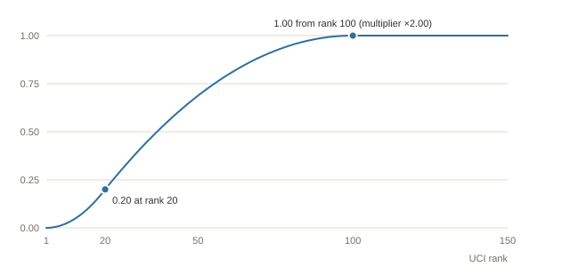

# Divine Guess the Top 10 — Scoring Model v2

## Purpose

This document defines the proposed v2 scoring model for **Divine Guess the Top 10**. It is intended to be standalone and implementation-ready, while keeping tunable values in configuration so they can be calibrated against historical race simulations.

The model rewards four kinds of accuracy:

1. Selecting riders who finish in the actual top 10.
2. Placing those riders close to their actual positions.
3. Correctly identifying the composition of the top 3, top 5, and top 10.
4. Correctly selecting three additional wildcard riders, rewarded by their actual finish band and difficulty-adjusted wildcard boost.

## Terminology and assumptions

- `guess[i]` is the rider selected in guessed position `i`, where `i ∈ {1..10}`.
- `actual[i]` is the rider who finished in actual position `i`, where `i ∈ {1..10}`.
- `uci_rank(r)` is the rider's UCI rank at the configured ranking snapshot.
- Positions are one-based.
- A valid top-10 guess contains ten distinct riders.
- The player selects three additional distinct wildcard riders, none of which may overlap the positioned top 10.
- Unless stated otherwise, all fractional scores are retained during calculation and rounded only once at the final score.
- A rider's UCI rank must be snapshotted before scoring so later ranking changes cannot alter historical results.

## Total score

For one player and one race:

```text
total_score = placement_score
            + permutation_score
            + wildcard_score
```

The low-UCI-rank multiplier affects only `placement_score`. It does not affect permutation bonuses or wildcard bonuses.

## 1. Placement score

For each guessed position `g` from 1 to 10, find the actual position `a` of the selected rider. If the rider is outside the actual top 10, that guess receives zero placement points.

```text
distance = abs(g - a)
distance_factor = distance_factors[distance]
base_points = top10_points[g]
position_multiplier = 1 + position_boost(uci_rank(rider))
position_points = base_points * distance_factor * rank_multiplier
```

The position points are summed over all ten guessed positions.

### Distance factors

Distance factors are configurable. The initial shape is a decreasing exponential curve, with these anchor values:

| Distance | Factor |
|---:|---:|
| 0 | 1.00× |
| 1 | 0.80× |
| 2–13 | Configured exponential interpolation |
| 14 | 0.10× |
| 15 or more | 0.00× |

One possible implementation is:

```text
distance_factor(d) = max(0, min(1, exp(-k * d)))
```

where `k` is chosen to produce a steeper decline than v1, or a precomputed table is used when exact calibration is preferred. The production configuration should store all values for distances 0 through 10 explicitly.

### Top-10 position points

| Guessed position | Base points |
|---:|---:|
| 1 | 15 |
| 2 | 10 |
| 3 | 8 |
| 4 | 7 |
| 5 | 6 |
| 6–10 | 5 each |

### Example

If a rider is guessed in position 1, actually finishes 3rd, has a distance factor of `0.64×`, and has a rank multiplier of `1.20×`:

```text
position_points = 15 * 0.64 * 1.20 = 11.52
```

## 2. Permutation bonuses

Permutation bonuses evaluate set membership, not order. A rider counts as matched when the guessed subset contains a rider from the corresponding actual subset.

| Scope | Condition | Bonus |
|---|---|---:|
| Top 3 | Exact set match (3/3) | 10 |
| Top 5 | Exact set match (5/5) | 10 |
| Top 5 | 4/5 set match | 5 |
| Top 5 | Fewer than 4/5 | 0 |
| Top 10 | At least 6/10 set match | 10 |
| Top 10 | 4–5/10 set match | 5 |
| Top 10 | Fewer than 4/10 | 0 |

Bonuses are awarded once per scope. They are not multiplied by distance or UCI rank. A top-10 exact match automatically satisfies the top-10 `>= 6/10` threshold; it does not create an additional permutation bonus beyond the table.

## 3. Wildcard riders

Wildcards are three additional riders selected after the ten positioned top-10 riders. They are not assigned predicted positions.

- Wildcards must be distinct from one another and from the positioned top 10.
- Wildcards receive no distance points, position points, or low-UCI-rank multiplier.
- Wildcards do not contribute to top-3, top-5, or top-10 permutation matching.
- Each wildcard receives at most one reward based on its actual finish band.

| Actual finish | Wildcard bonus |
|---|---:|
| 1st–3rd | 10 |
| 4th–5th | 7 |
| 6th–10th | 5 |
| 11th or lower | 0 |

```text
wildcard_score = sum(base_bonus(w) * wildcard_multiplier(uci_rank(w))
                     for w in the 3 wildcards)
```

The maximum base wildcard score is `10 + 10 + 10 = 30`. These values are the current defaults and can be calibrated through simulation.

### Wildcard multiplier

The wildcard multiplier is intentionally aggressive for lower-ranked riders:

- Ranks 1–99 receive a suppressing factor between `0.00×` and `1.00×`.
- Ranks 1–30/40 should remain close to `0.00×`; the curve then rises gradually and becomes meaningful around ranks 70–80.
- Rank 100 starts at `1.00×`.
- The factor increases linearly from `1.00×` at rank 100 to `3.00×` at rank 500.
- Rank 500+ is capped at `3.00×`.

```text
wildcard_multiplier(r) = low_rank_curve(r)       if 1 <= r < 100
wildcard_multiplier(r) = 1 + 2 * (r - 100)/400  if 100 <= r < 500
wildcard_multiplier(r) = 3.00                    if r >= 500
```

The low-rank curve is exponential-shaped, monotonic, bounded by `0.00×` and `1.00×`, and continuous at rank 100. A rank-500+ rider finishing on the podium can therefore earn `10 × 3.00 = 30` wildcard points.

## 4. Positioned-rider boost

The positioned-rider boost applies only to placement points. It is capped at `2.00x` and uses an S-shaped rank curve: it is convex through the top 20, reaches approximately `0.20` at rank 20, then becomes concave from ranks 20–100. It reaches `1.00` at rank 100 and remains constant thereafter.

### Positioned-rider multiplier

The positioned-rider boost is defined directly by the continuous function below. There is no separate rank-tier table or additive wildcard interpretation for this boost:

```text
position_multiplier = 1 + position_boost
```

<!-- Legacy tier table removed from the scoring model.

Under this interpretation:

| UCI rank | Rank boost | Resulting multiplier |
|---:|---:|---:|
| 1–30 | 0.00 | 1.00× |
| 31–99 | Continuous ramp toward 1.00 | 1.00× to 2.00× |
| 100–199 | 1.00 | 2.00× |
| 200–299 | 2.00 | 3.00× |
| 300–399 | 3.00 | 4.00× |
| 400–499 | 4.00 | 5.00× |
| 500+ | 5.00, capped | 6.00× |

This resolves the apparent conflict between “rank 1 = 0.0×” and the example where rank 1 has a final multiplier of `1.00×`. If the intended table values are final multipliers instead, remove the `1 +` and configure the table directly.

-->

### Proposed continuous function

The recommended shape is a piecewise S-curve from rank 1 to rank 100, followed by a flat `2.00x` multiplier.

```text
position_boost(r) = 0.20 * ((r - 1) / 19)^2        if 1 <= r <= 20
position_boost(r) = 1 - 0.80 * ((100 - r) / 80)^2 if 20 < r < 100
position_boost(r) = 1.00                           if r >= 100
```

This default curve gives rank 1 a `0.00` boost, rank 20 a `0.20` boost, and rank 100 a `1.00` boost. The rank-20 join is nearly smooth; if exact derivative continuity is required, use a cubic Hermite or smoothstep implementation with the same anchor points.

where `low_target` is typically `0.05–0.15`, and `k` controls how late the ramp accelerates. The default should be selected through simulation, not hard-coded from intuition.

The implementation should either use this continuous curve or a precomputed lookup table. It must clamp the final boost to the configured maximum.

#### Curve illustration

The following illustration shows the intended S-shaped positioned-rider boost. The curve is restrained through rank 20, then rises more meaningfully toward rank 100.



### Deprecated rank-band bonus proposal

The following additional rank-based point bonuses were proposed for simulation:

| Rider rank group | Candidate bonus |
|---|---:|
| Top 3 | 15 |
| Top 5 | 10 |
| Top 10 | 5 |
| Top 20 | 1 |

These values are now the candidate **wildcard finish-band rewards** defined in the previous section. They must not be added again as a separate UCI-rank bonus or multiplied into positioned-rider points.

## Calculation order

1. Load the race result and the frozen UCI ranking snapshot.
2. Validate the player's ten distinct selections.
3. For each guessed position, resolve actual position and calculate distance, base points, positioned-rider boost, and position points.
4. Validate the three wildcards against the positioned selections.
5. Calculate top-3, top-5, and top-10 set matches using positioned selections only.
6. Apply permutation bonuses.
7. Calculate and apply wildcard bonuses.
8. Sum the components and round once for display/storage.
9. Persist a scoring breakdown so the result can be audited and re-calculated after configuration changes.

## Suggested configuration

```json
{
  "distance_factors": [1.0, 0.8, 0.62, 0.47, 0.35, 0.26, 0.19, 0.13, 0.08, 0.04, 0.0],
  "top10_points": [15, 10, 8, 7, 6, 5, 5, 5, 5, 5],
  "permutation_bonuses": {
    "top3_exact": 10,
    "top5_exact": 10,
    "top5_four_of_five": 5,
    "top10_six_or_more": 10,
    "top10_four_or_five": 5
  },
  "wildcards": {
    "count": 3,
    "bonuses": { "top3": 10, "top5": 7, "top10": 5 }
  },
  "position_boost": {
    "max": 2.0,
    "wildcard_max": 3.0,
    "low_target": 0.1,
    "transition_rank": 100,
    "cap_rank": 500
  }
}
```

The distance values above are illustrative defaults, not final calibrated values. Configuration should be versioned with the scoring-model version.

## Test cases and invariants

- An exact top-10 guess receives all ten base position values, rank multipliers, and all eligible permutation bonuses.
- A rider outside the actual top 10 receives zero placement points, regardless of UCI rank.
- A rider guessed 11 or more positions from the actual position receives zero placement points.
- Rank multipliers never affect permutation bonuses or wildcard bonuses.
- The rank boost is monotonic: a worse UCI rank must never receive a smaller boost.
- The positioned-rider multiplier is capped at 2.00x from approximately rank 100 onward, and the wildcard multiplier is capped at 3.00x from rank 500 onward.
- Duplicate guesses are rejected before scoring.
- Re-scoring the same guess with the same result and configuration is deterministic.

## Simulation and calibration plan

Before release, run the model against historical races and realistic player strategies:

1. Generate baseline guesses using UCI rank, bookmaker odds if available, recent form, random picks, and mixed strategies.
2. Compare score distributions, median scores, maximum scores, and rank ordering stability.
3. Measure how often the rank boost contributes more than 25%, 50%, and 75% of a player's total score.
4. Test sensitivity to `low_target`, the linear ramp, the cap, and the distance curve.
5. Confirm that a high-quality guess remains competitive with a low-ranked-rider hunting strategy.
6. Select parameters that create meaningful differentiation without making outcomes depend on one unusually low-ranked rider.

## Critique and recommendations

### Main risks

1. **Wildcard rewards can be strategically strong.** Three wildcards with 15/10/5/1 rewards may become a low-risk way to collect points without making difficult positional predictions.
2. **Rank quality is not the same as rider difficulty.** UCI rank may lag current form, reflect different race calendars, or be unavailable/comparable across all riders. It should be treated as a difficulty proxy, not ground truth.
3. **A hard cap still permits jackpot behavior.** A `6.00×` multiplier under the additive interpretation is powerful. Players may optimize for one rank-500+ rider rather than predict the full top 10.
4. **Tier boundaries create discontinuities.** A rider moving from rank 199 to 200 can receive a materially different score for an insignificant ranking change. A continuous curve is preferable.
5. **Wildcard overlap must be prevented.** Wildcards must remain outside positioned selections and permutation matching, otherwise the same rider can earn multiple rewards for one prediction.

### Recommended guardrails

- Start with `rank_multiplier = 1 + rank_boost`, but lower the maximum effective multiplier during initial testing, for example to `3.0–4.0×`.
- Do not add the proposed rank bonus points until simulations show that the multiplier alone is insufficient.
- Consider a soft cap or diminishing returns above rank 300 rather than a flat `5.0` boost.
- Publish a score breakdown to players: placement, distance, rank boost, permutations, and wildcard rewards.
- Freeze the UCI snapshot and record its source date.
- Rebalance periodically using historical data, with a versioned configuration and migration policy.
- Add a fairness check: compare the score of a rank-based strategy with a form/odds-based strategy and a random strategy.

The v2 model should be considered ready only after the ambiguity around multiplier semantics is resolved and simulation confirms that low-ranked selections improve strategic variety without eclipsing accurate top-10 prediction.

## Implementation notes (rules version v2.0)

The model is implemented in `app/scoring.py`; every number below lives in `ScoringRules` and is stored with each published score run. Where this document allowed more than one reading, the implementation chose as follows.

| Question | Implemented | Where to change it |
|---|---|---|
| Which finishes earn placement points | Actual top 10 only, as the placement section and invariants state. The backlog's "position 24 is the last that can score" reading is one setting away. | `placement_depth` (10; set 24 for the deep reading) |
| Distance factors | The anchor table: 1.00, 0.80, then exponential to 0.10 at 14, zero from 15: `1.0, 0.8, 0.68, 0.58, 0.5, 0.42, 0.36, 0.31, 0.26, 0.22, 0.19, 0.16, 0.14, 0.12, 0.1`. This differs from the illustrative suggested configuration (0.62, 0.47, … 0.0 at 10) and from the example's 0.64 at two places. | `distance_factors` |
| Wildcard finish bands | 10 / 7 / 5 / 0, per the wildcard table, the 30-point podium example and the suggested configuration. The 15 / 10 / 5 / 1 candidates of the deprecated section are not used. | `wildcards.bonuses` |
| Wildcard low-rank curve | `(e^(kx) − 1) / (e^k − 1)` with `x = (rank − 1) / 99` and `k = 2 ln(1 / low_target − 1)`, so `low_target` (0.10) is the multiplier halfway up the ramp: ×0.03 at rank 30, ×0.10 at 50, ×0.32 at 75, ×1.00 at 100. | `position_boost.low_target` |
| Positioned-rider boost | The S-curve exactly as specified (0.20 at rank 20, 1.00 from rank 100); rank 30 gets ×1.39, steeper than the backlog's illustrative ×1.2. | `position_boost.knee_*`, `max`, `transition_rank` |
| Unranked riders | Treated as the hardest pick: ×2.00 positioned, ×3.00 as a wildcard. | `app/scoring.py` `_known_rank` |
| UCI rank snapshot | `event_riders.uci_rank`, imported with the startlist; each stored score line keeps the rank it used. | — |
| Rounding | Components keep six decimals; only the total is rounded, to two. | — |
| Incomplete predictions | Allowed; an empty slot scores nothing. | — |
| v1 conviction boost | Not part of v2; no longer offered or scored. | — |
| Results entry | Admin can enter finishes through 25th (lineage view, and room for a placement depth up to 24). | `MAX_RESULT_POSITION` |

The player-facing explanation is `frontend/scoring.md`, served as `scoring.html`; `tests/test_scoring_guide.py` fails if its numbers drift from the rules. The curves in this document and in the guide are drawn from the live rules by `python -m scripts.render_scoring_figures`.
