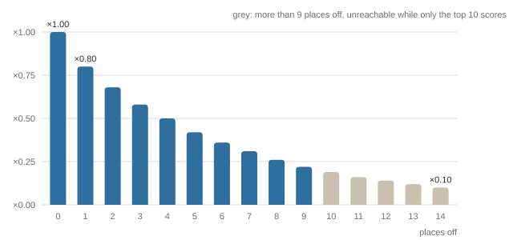
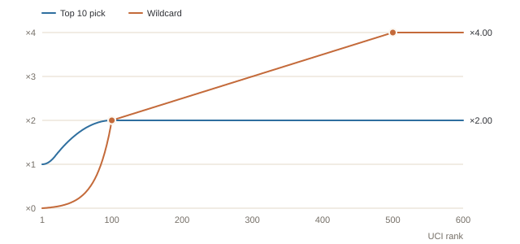

# How scoring works

**In one sentence:** scoring rewards Top 10 accuracy — lower-ranked riders earn more, and the better you call the podium, the more you score.

Your score for the race has three parts, added together:

| Part | What earns it | Most it can give |
|---|---|---:|
| **Placement** | each of your ten riders who finishes close to where you placed them — up to 9 places off, even outside the top 10 | 142 pts |
| **Permutations** | naming the right riders in the top 3, top 5 and top 10, in any order | 30 pts |
| **Wildcards** | three extra riders who finish in the top 10 | 120 pts |

```
score = placement + permutations + wildcards
```

The rest of this page explains every rule, with the exact numbers the game uses (rules version **v3.0**).

---

## 1. Placement points

Each rider in your Top 10 is scored on their own, by how close they finished to the position you gave them — **even outside the top 10**: put a rider 10th, see them finish 11th, and it counts as one place off. Three things decide how many points:

```
placement points = base points × distance factor × rank multiplier
```

### Base points: where you put the rider

The base is set by the position **you** guessed, not by where the rider finished. Your top picks carry the most weight.

| Your position | 1st | 2nd | 3rd | 4th | 5th | 6th–10th |
|---|---:|---:|---:|---:|---:|---:|
| **Base points** | 15 | 10 | 8 | 7 | 6 | 5 each |

### Distance factor: how close you were

The distance is how many places your guess was off. An exact call keeps all the base points; every place further away keeps a quarter less — the factor is 0.75 to the power of the places off.

| Places off | 0 | 1 | 2 | 3 | 4 | 5 | 6 | 7 | 8 | 9 | 10+ |
|---|---:|---:|---:|---:|---:|---:|---:|---:|---:|---:|---:|
| **Factor** | ×1.000 | ×0.750 | ×0.563 | ×0.422 | ×0.316 | ×0.237 | ×0.178 | ×0.133 | ×0.100 | ×0.075 | ×0 |



Ten or more places off earns nothing. So your 10th pick can still score with a finish as low as 19th, and your 1st pick down to 10th.

A rider who finishes 10 or more places from your guess, does not finish (DNF), or does not start earns **no placement points**, however obscure they are.

### Rank multiplier: how hard the pick was

Calling a favourite is easy; calling an outsider is not. Every placement is multiplied by a factor based on the rider's **UCI rank**:

- rank 1 keeps ×1.00 — no extra;
- the multiplier grows slowly through the top 20 (×1.20 at rank 20);
- then faster, reaching the **cap of ×2.00 at rank 100**;
- every rider ranked 100th or lower, and every unranked rider, gets ×2.00.

| UCI rank | 1 | 5 | 10 | 20 | 30 | 50 | 75 | 100+ |
|---|---:|---:|---:|---:|---:|---:|---:|---:|
| **Top 10 multiplier** | ×1.00 | ×1.01 | ×1.04 | ×1.20 | ×1.39 | ×1.69 | ×1.92 | ×2.00 |



The multiplier applies **only to placement points** — never to permutation bonuses. Next to each pick in your Top 10 you can see its multiplier, for example ×1.39.

### Example

You put a rider ranked 30th in **1st**, and they finish **3rd**: base 15, two places off (×0.563), rank multiplier ×1.39.

```
15 × 0.563 × 1.39 = 11.71 points
```

---

## 2. Permutation bonuses

These reward naming the right group of riders, **in any order**. The game compares the riders you placed in your top 3, top 5 and top 10 with the riders who actually finished there.

| Group | You name | Bonus |
|---|---|---:|
| **Top 3** | all 3 | 10 |
| **Top 5** | all 5 | 10 |
| | 4 of 5 | 5 |
| **Top 10** | 6 or more of 10 | 10 |
| | 4 or 5 of 10 | 5 |

- Each group pays at most once: naming 8 of the top 10 earns the same 10 points as naming 6.
- The groups add up: a perfect top 3 inside a perfect top 5 inside 6+ of the top 10 earns 10 + 10 + 10 = **30 points**.
- Order inside a group does not matter. Guessing the podium as 3–1–2 still names all three.
- Bonuses are flat: the rank multiplier and the distance factor do not touch them.
- Wildcards never count towards these groups.

---

## 3. Wildcards

Besides your Top 10 you pick **three wildcards**: extra riders without a position. They are your chance to back an outsider without risking a Top 10 slot on them.

- A wildcard cannot also be in your Top 10, and you cannot pick the same rider twice.
- They have no order, so there is no distance factor.
- Each wildcard earns a bonus by the band it finishes in:

| Wildcard finishes | 1st–3rd | 4th–5th | 6th–10th | 11th or lower |
|---|---:|---:|---:|---:|
| **Bonus** | 10 | 7 | 5 | 0 |

The bonus is then multiplied by the **wildcard multiplier**, which is deliberately steep:

- favourites are worth almost nothing as wildcards — a rider in the top 30 of the UCI ranking gets about ×0.07 at most, so even a podium from them adds under a point;
- the multiplier starts to matter around ranks 70–80 and reaches **×2.00 at rank 100**;
- from there it rises steadily to its **cap of ×4.00 at rank 500**;
- riders ranked 500th or lower, and unranked riders, get ×4.00.

| UCI rank | 1 | 10 | 30 | 50 | 75 | 100 | 200 | 300 | 400 | 500+ |
|---|---:|---:|---:|---:|---:|---:|---:|---:|---:|---:|
| **Wildcard multiplier** | ×0.00 | ×0.01 | ×0.07 | ×0.20 | ×0.64 | ×2.00 | ×2.50 | ×3.00 | ×3.50 | ×4.00 |

So a rider ranked 500th or lower who reaches the podium as your wildcard is worth **10 × 4.00 = 40 points**. Next to each wildcard you pick you can see its multiplier.

---

## A full example

Your Top 10, and how the race went. Ranks are UCI ranks.

| Your pick | UCI rank | Finished | Base | Distance | Rank | Points |
|---|---:|---:|---:|---:|---:|---:|
| 1st | 1 | 2nd | 15 | ×0.750 | ×1.00 | 11.25 |
| 2nd | 3 | 1st | 10 | ×0.750 | ×1.00 | 7.52 |
| 3rd | 12 | 3rd | 8 | ×1.000 | ×1.07 | 8.54 |
| 4th | 30 | 6th | 7 | ×0.563 | ×1.39 | 5.46 |
| 5th | 8 | 4th | 6 | ×0.750 | ×1.03 | 4.62 |
| 6th | 45 | 14th | 5 | ×0.100 | ×1.62 | 0.81 |
| 7th | 75 | DNF | 5 | — | ×1.92 | 0 |
| 8th | 140 | 9th | 5 | ×0.750 | ×2.00 | 7.50 |
| 9th | 22 | 18th | 5 | ×0.075 | ×1.24 | 0.47 |
| 10th | 5 | 7th | 5 | ×0.422 | ×1.01 | 2.13 |

**Placement: 48.29 points.** Your 6th and 9th picks finished outside the top 10 but within 9 places of your guess, so they still score. The rows are shown rounded; the total adds the unrounded values.

**Permutations: 25 points.** Your top 3 is the actual top 3 in a different order (10). Four of your top 5 finished in the top 5 — your 4th pick finished 6th (5). Seven of your ten finished in the top 10 (10).

**Wildcards: 28 points.** One wildcard, ranked 520th, finished 5th: 7 × 4.00 = 28. The other two, ranked 160th and 35th, finished 11th and did not finish, so they earn nothing.

**Total: 48.29 + 25 + 28 = 101.29 points.**

---

## The fine print

- **Which UCI rank counts.** The rank shown in the game when predictions close — the ranking imported with the startlist — is the one used. It is frozen with the published scores, so a later ranking update never changes a result.
- **Unranked riders** count as the hardest possible pick: ×2.00 in your Top 10, ×4.00 as a wildcard.
- **Incomplete predictions** are allowed. An empty Top 10 position or wildcard slot simply scores nothing.
- **Did not finish, did not start, disqualified**: the rider has no classified finish, so they earn no placement points and no wildcard bonus.
- **Finishes below 10th** earn placement points when they are within 9 places of your guess; results are entered down to 25th. The permutation bonuses and wildcards look at the top 10 only.
- **Rounding.** Every part keeps its fractions; only the final score is rounded, to two decimals. That is why rounded rows can add up to a cent more or less than the total.
- **Ties** are not broken: players on equal points are simply listed alphabetically.
- **Your final prediction** — the list on the *Final* tab, as last saved before the deadline — is the one scored. Templates are private drafts and never count.
- **Stored results.** When the result is published, every score is stored with the rules version it was calculated under, so the leaderboard never changes afterwards.

*Rules version v3.0. The design notes behind these numbers are in the repository at `docs/SCORING_MODEL_V2.md`.*
